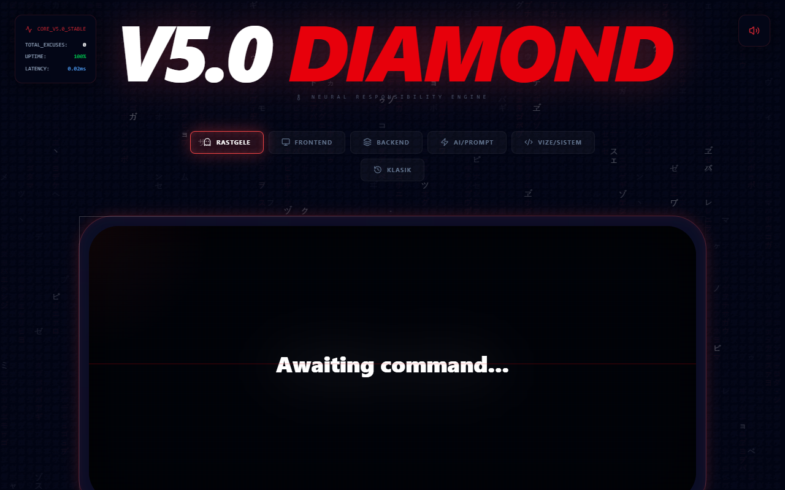

<div align="center">

# 💎 Yazılımcı Bahane Makinesi V5.0 (Diamond Release)

<p align="center">
  <b>"The No Regrets Engine"</b><br/>
  Sorumluluk almak istemeyen profesyonel yazılımcılar ve vizelerle boğuşan mühendislik öğrencileri için geliştirilmiş, siberpunk temalı tam donanımlı bir bahane üretim merkezi.
</p>

[](https://react.dev/)
[](https://vitejs.dev/)
[](https://tailwindcss.com/)
[](https://www.framer.com/motion/)
[](LICENSE)

<br/>



</div>

---

## 🌌 Proje Hakkında

V5.0 "Diamond Release" sürümüyle birlikte bu uygulama, sıradan bir rastgele metin üreticisinden çıkarak tam teşekküllü bir **"Cyberpunk Decipher"** (Şifre Çözücü) motoruna dönüştü. Modern web teknolojileri kullanılarak geliştirilen bu sistem, sadece bahaneler üretmekle kalmaz; aynı zamanda görsel ve işitsel bir şölen sunar.

Bahaneler 5 ana kategoride toplanmıştır:
- 🖥️ **Frontend:** Tarayıcı uyuşmazlıkları ve CSS gizemleri.
- ⚙️ **Backend:** Veritabanı kilitlenmeleri ve mikroservis faciaları.
- 🤖 **AI/Prompt:** Halüsinasyon gören yapay zeka modelleri.
- 🎓 **Vize/Sistem:** Akademik yoğunluk ve donanım yetersizlikleri.
- 📜 **Klasik:** "Benim makinemde çalışıyordu!" tarzı efsaneler.

---

## ✨ Öne Çıkan Özellikler

* **🧬 Decipher Motoru:** Bahaneler ekrana düşerken "matrix" benzeri şifrelenmiş bir animasyonla açılır ve pürüzsüz bir blur-reveal efektiyle netleşir.
* **💎 Glassmorphism 2.0 & 3D Tilt:** Farenizin hareketine duyarlı, ışığı yansıtan, derinlikli cam efektli ana panel.
* **🔊 Sibernetik Ses Motoru:** `Web Audio API` kullanılarak sıfır gecikmeyle gerçek zamanlı sentezlenen retro-fütüristik sistem sesleri.
* **🚀 Yüksek Performans:** GPU hızlandırmalı HTML5 Canvas arkaplanı ("Digital Rain") ve optimize edilmiş `Framer Motion` geçişleri.
* **🎯 Dinamik Tipografi:** Üretilen mazeretin uzunluğuna göre font boyutunu otomatik olarak ayarlayan akıllı mizanpaj.

---

## 🛠️ Teknolojik Altyapı

| Kategori | Teknoloji / Kütüphane |
| :--- | :--- |
| **Core** | React 19, Vite 8 |
| **Stil & Tasarım** | Tailwind CSS v4, Lucide React (İkonlar) |
| **Animasyonlar** | Framer Motion 12 |
| **Ses & Görsel** | Web Audio API, HTML5 Canvas API |

---

## 🚀 Hızlı Kurulum

Projeyi kendi bilgisayarınızda çalıştırmak için aşağıdaki adımları izleyebilirsiniz:

1. **Repoyu bilgisayarınıza klonlayın:**
   ```bash
   git clone https://github.com/ziyaguner/developer-excuse-generator.git
   ```

2. **Proje dizinine gidin:**
   ```bash
   cd developer-excuse-generator
   ```

3. **Bağımlılıkları yükleyin:**
   ```bash
   npm install
   ```

4. **Geliştirme sunucusunu başlatın:**
   ```bash
   npm run dev
   ```

---

## 🤝 Katkıda Bulunma

Eğer yeni bahaneler eklemek veya projenin özelliklerini geliştirmek isterseniz, lütfen bir "Pull Request" (PR) oluşturmaktan çekinmeyin! Sistemin mükemmelliğine sizin de katkınız olsun.

---

<div align="center">
  <i>"Çalışmıyorsa sorun bende değil, bilgisayardadır."</i>
</div>