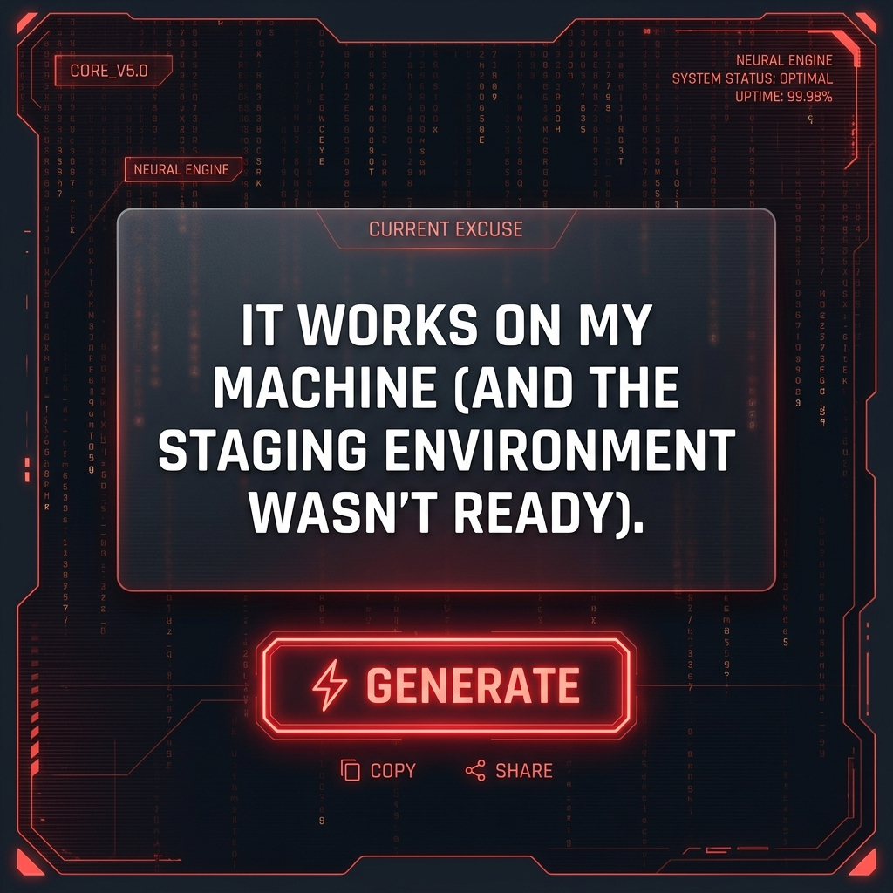
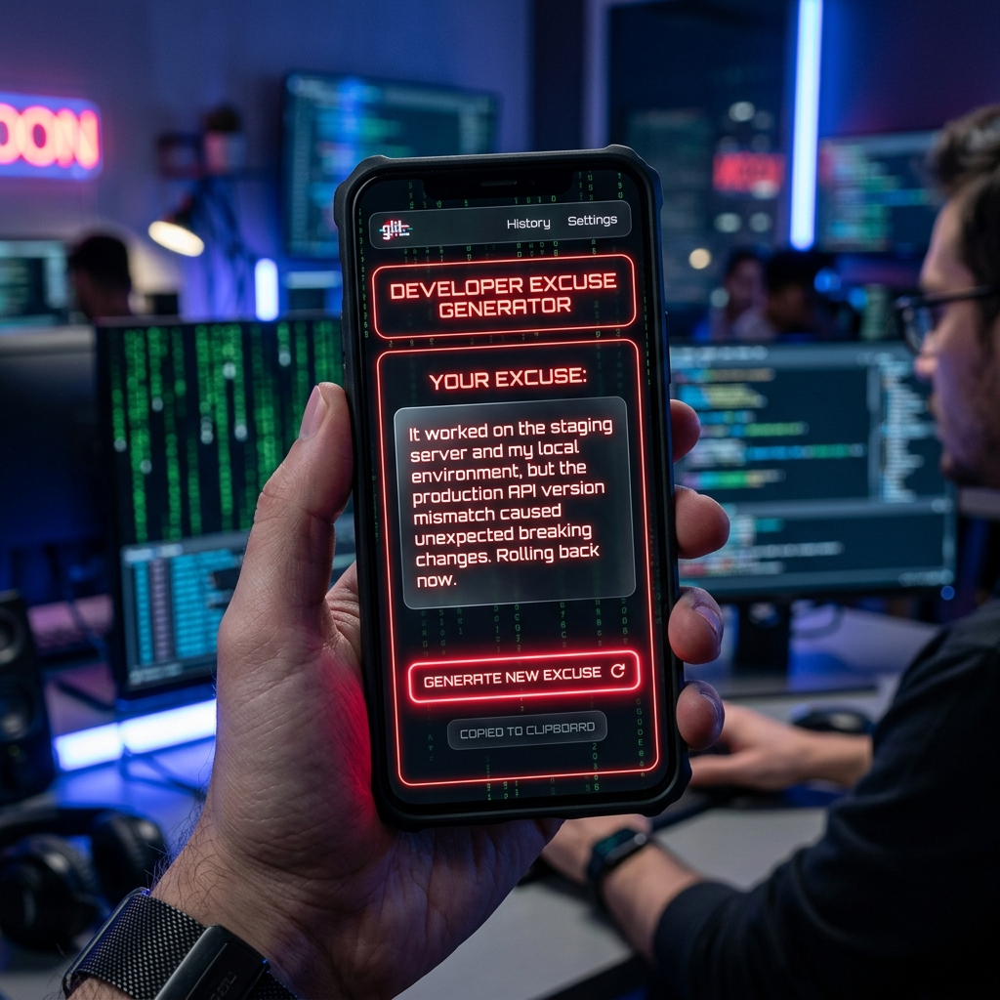
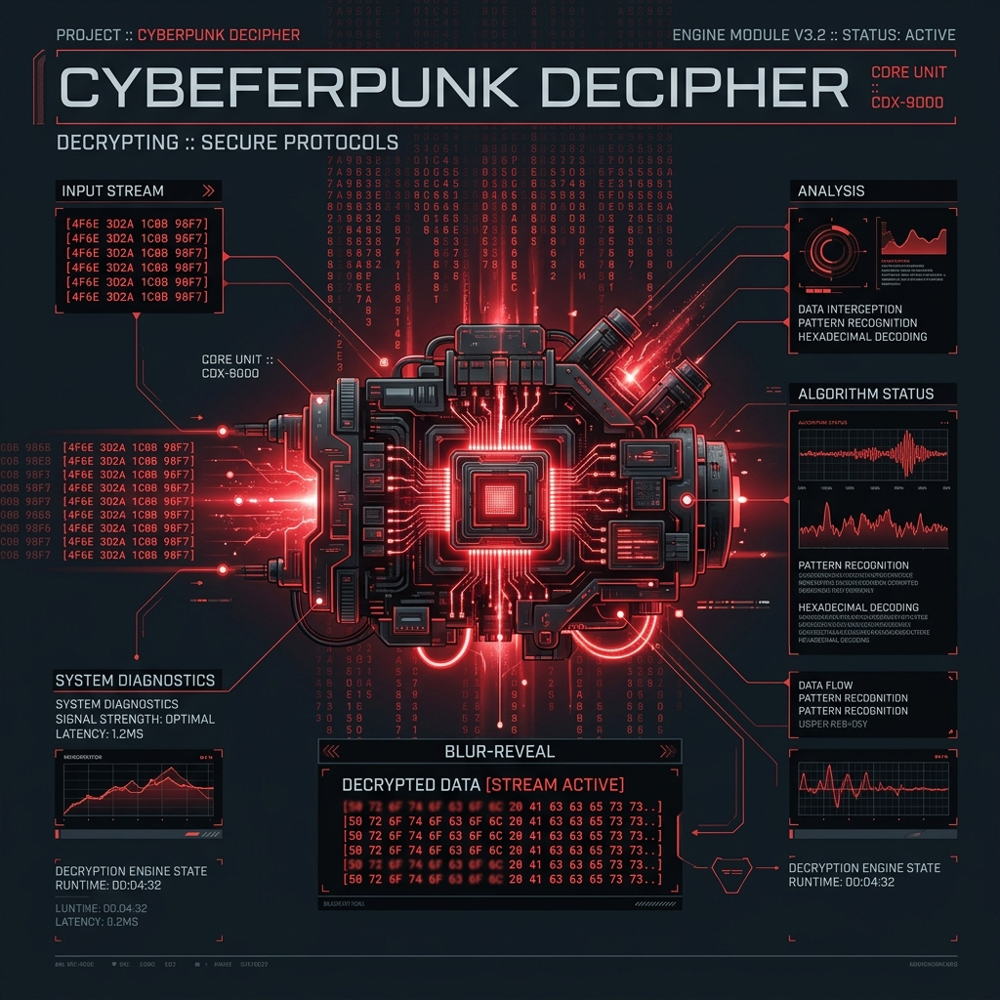

<div align="center">


<br/>

<a href="https://github.com/ziyaguner/developer-excuse-generator">
  
</a>

<br/><br/>

[](https://reactjs.org/)
[](https://www.framer.com/motion/)
[](https://tailwindcss.com/)
[](https://vitejs.dev/)
[](LICENSE)

<p align="center">
  <b>"The No Regrets Engine"</b> — Sorumluluk almak istemeyen profesyonel yazılımcılar için <br/>
  geliştirilmiş, Diamond kalitesinde bir bahane üretim merkezi.
</p>

</div>

---

## 📸 Ekran Görüntüleri

### 🖥️ Ana Panel (Cyberpunk UI)
<div align="center">
  
</div>

<br/>

### 📱 Mobil Uyumluluk & HUD
<div align="center">
  
  
</div>

---

## 🌌 Diamond Deneyimi

V5.0 sürümüyle birlikte uygulama, sıradan bir slot makinesinden tam teşekküllü bir **"Cyberpunk Decipher"** (Şifre Çözücü) motoruna dönüştü.

### ✨ Öne Çıkan Özellikler
- 🧬 **Decipher Motoru**: Bahaneler ekrana düşerken Hexadecimal kodlarla şifrelenmiş bir animasyonla açılır ve pürüzsüz bir blur-reveal efektiyle görünür hale gelir.
- 📐 **Dinamik Tipografi**: Metin uzunluğuna göre font boyutunu otomatik ayarlayan akıllı mizanpaj.
- 💎 **Glassmorphism 2.0**: Işığa duyarlı katmanlar, iç parlamalı (inset) kenarlar ve derinlikli cam efekti.
- 🔦 **Dynamic Spotlight**: İmlecinizi takip eden, camın arkasından süzülen gerçek zamanlı aydınlatma efekti.
- 🚀 **60FPS Performans**: GPU hızlandırmalı Canvas Matrix arka planı ve optimize edilmiş Framer Motion geçişleri.
- 🔥 **Termal Throttling**: Anti-spam koruması sağlayan, aşırı tıklamada sistemi soğumaya alan emniyet protokolü.
- 🔊 **Sibernetik Ses Motoru**: Web Audio API ile sıfır gecikmeli, gerçek zamanlı sentezlenen ses efektleri.

---

## 🛠️ Teknoloji Yığını

<div align="center">

```
┌─────────────────────────────────────────────────────────────────┐
│                         FRONTEND                                │
│   React 18 + Vite  ·  TailwindCSS 3  ·  Framer Motion           │
│   Lucide Icons  ·  Web Audio API  ·  HTML5 Canvas               │
├─────────────────────────────────────────────────────────────────┤
│                        DESIGN SYSTEM                            │
│   Glassmorphism 2.0  ·  Cyberpunk Red Aesthetic                  │
│   Responsive HUD Design  ·  Digital Rain Background             │
└─────────────────────────────────────────────────────────────────┘
```

</div>

---

## 🚀 Hızlı Kurulum

1. Repoyu bilgisayarınıza indirin:
   ```bash
   git clone https://github.com/ziyaguner/developer-excuse-generator.git
   ```
2. Bağımlılıkları yükleyin:
   ```bash
   npm install
   ```
3. Uygulamayı başlatın:
   ```bash
   npm run dev
   ```

---

## 🕹️ Gizli Protokoller (Easter Eggs)

- **BUG Modu:** Klavyeden ardışık olarak **"BUG"** yazarak sistemin kırmızı alarm moduna geçişini tetikleyin.
- **Aşırı Isınma:** Generate butonuna çok hızlı yüklenerek sistemin kendisini korumaya alışını izleyin (Thermal Throttling).

---

<div align="center">


**Yazılımcı Bahane Makinesi** ile her hataya profesyonel bir açıklama! 💎🔥

[](https://github.com/ziyaguner/developer-excuse-generator/stargazers)

Made with ❤️ by [ziyaguner](https://github.com/ziyaguner)

</div>
